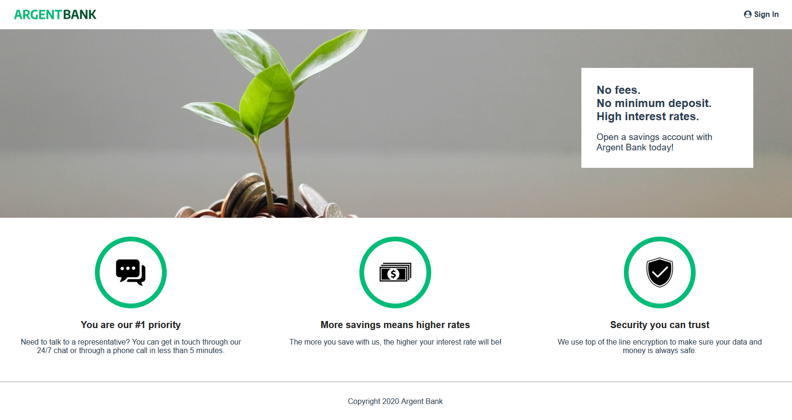

[](https://forthebadge.com) [](https://forthebadge.com) [](https://forthebadge.com)

# ARGENT BANK

A React app for managing a user Bank Account



## Dependencies

- [Node.js (v14.17.1)](https://nodejs.org/en/)
- [React](https://reactjs.org/) v17.0.2
- [react-router-dom](https://reactrouter.com/web/guides/quick-start) v6
- [redux](https://redux.js.org/introduction/getting-startedrea) v4.1.2
- [react-redux](https://react-redux.js.org/introduction/getting-started) v7.2.6
- [immer](https://immerjs.github.io/immer/) v9.0.12

## Installation

1. Clone this repository
   ```sh
   git clone https://github.com/https://github.com/yflly/YadaLy_13_11032022.git
   ```
2. Install NPM packages
   ```sh
   npm i
   ```
3. Run the project (port 3000 by default)

   ```sh
   npm start
   ```
 
 ## BackEnd
To get the backend, clone this repository and follow the instructions [here](https://github.com/OpenClassrooms-Student-Center/Project-10-Bank-API).

